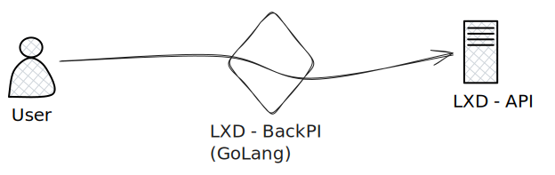
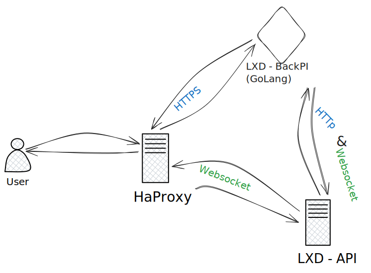

# Fonctionnement API LXD

L'API RestFULL de LXD permet d'intéragir depuis différentes route HTTP pour permettre une gestion des containeurs, des clusters, des snapshots, ou encore du terminal de commande.

Pour éviter d'exposer toutes l'API de LXD et permettre une gestion des utilisateurs plus souple, nous avons décidé d'ajouter notre propre serveur WEB entre l'utilisateur et l'API.




## Opérations

LXD permet une gestion asynchrone des tâches. En effet certaines tâches peuvent mettre plus ou moins longtemps a se faire (Allumage d'une instance, Création d'un cluster, Restauration d'une snapshot, ...).
Pour éviter d'attendre LXD retourne directement une ``Operation``, qui va permettre avec certaines routes de pouvoir suivre l'avancement de la tâche.

Il existe plusieurs manière de récupérer l'état de l'opération :

- ``/1.0/operations/{ID}`` - Retourne un JSON avec différentes informations (status, description, ...)
- ``/1.0/operations/{ID}/websocket`` - Permet l'ouverture d'un websocket qui va recevoir des messages en fonction de l'avancement
- ``/1.0/operations/{ID}/wait`` - Va attendre la fin (ou le faille) de l'opération pour renvoyer une réponse.


## Terminal

LXD fourni la possibilité de mettre en place un terminal, pour cela il se repose sur le protocole WebSocket.

Le Websocket ouvre un canal de communication bi-directionnel entre le serveur web et le client. Cela à plusieurs avantages comme :

- Pouvoir notifier le client d'une modification
- L'envoie de donnée du serveur vers le client sans requête du client.

Cela permet de pousser l'interactivité au maximum.

LXD permet l'ouverture d'un websocket après l'éxécution d'une commande (ici ``bash``),
après l'ouverture du socket LXD retourne les flux de sortie (stdout, stderr) et récupère le flux d'entrée (stdin)

### Websocket

Pour que le websocket fonctionne, le client doit parler directement a l'API LXD sans passer par notre serveur.
Pour cela nous avons proxifié une partie de l'api LXD pour la faire passer dans notre back :




# Dépendances du projet
## Go-Chi
Go-chi est un routeur léger et facile à prendre en main. Nous avons choisi cette dépendances pour plusieurs points :
- **Simplification :** la syntaxe simple nous permets de nous concentrer sur notre application sans trop nous soucier du fonctionnement du routing.
- **Concurrence :** les autres projets comme *Way*, *Gin* et *Fiber* sont plus complets/complexe ; il était alors plus logique pour notre projet de choisir un routeur léger.

Le service Go-chi nous permet donc de faire le routing général de l'application grâce aux méthodes `GET|POST|PUT|DELETE`.
Voici un exemple de son utilisation :
```golang
r := chi.NewRouter()
r.Get("/", homepage)
r.Post("/container", createContainer)
r.Delete("/container/{name}", deleteContainer)
```

Dans l'exemple ci-dessus on crée un router, et comme avec le paquet `net/http`, on précise son pattern ainsi qu'une fonction utiliser pour cette route.
La fonction `createContainer()` va faire un appel à la fonction éponyme.
Tout les retours des fonctions de handling renvoient du JSON, facilitant ainsi la communication entre le front-end et le back-end. 


# Structure du code
## Code applicatif
Puisque nous avons appris la programmation objets lors de nos cours, nous avons architecturé avec une "classe" (fichier)  pour un "objet" (structure).

### Authentification


## Tests unitaires

